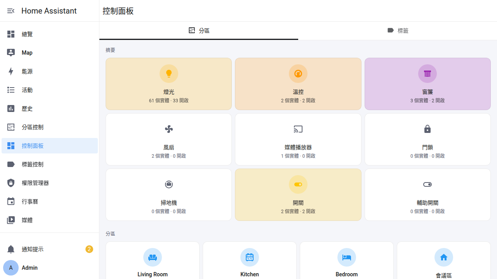
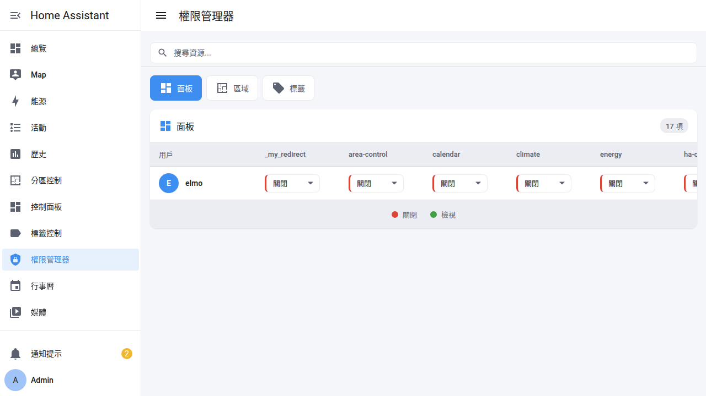
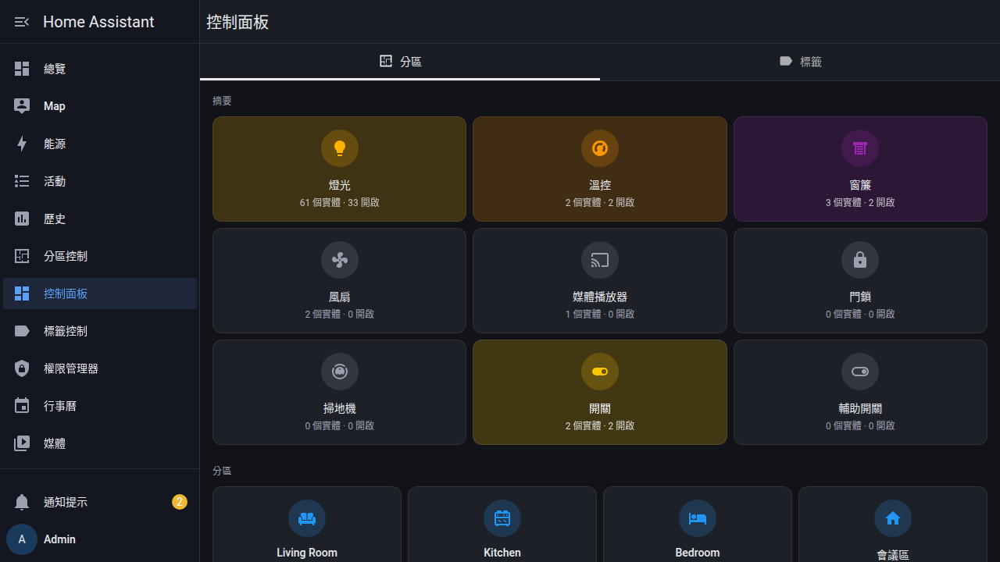
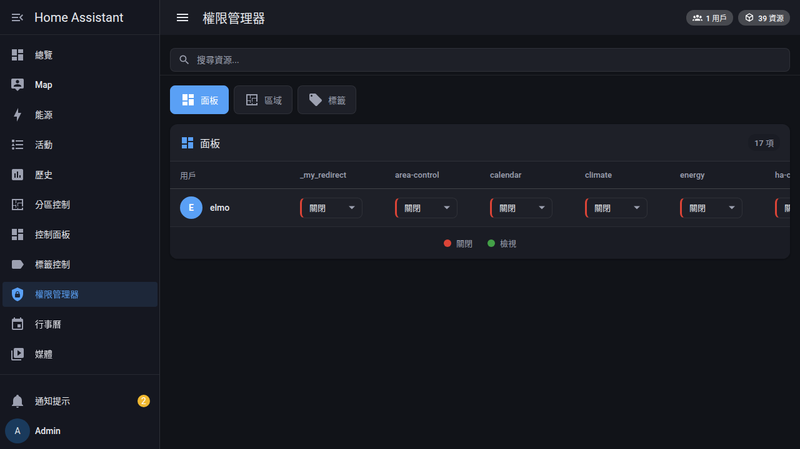
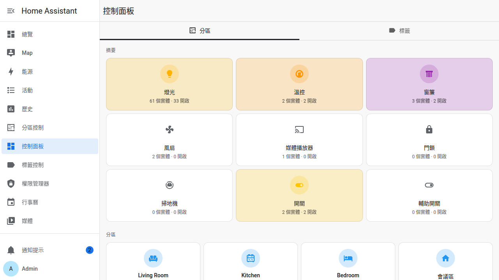
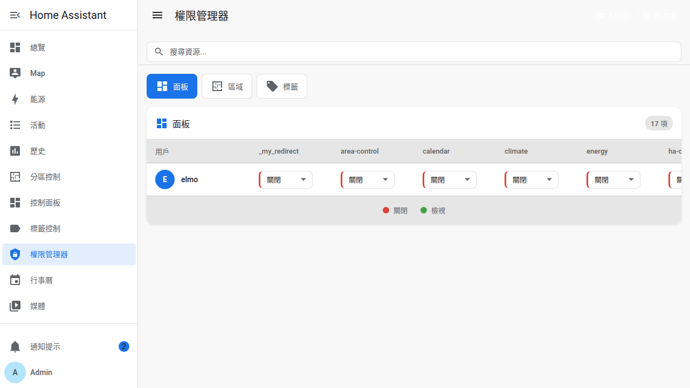
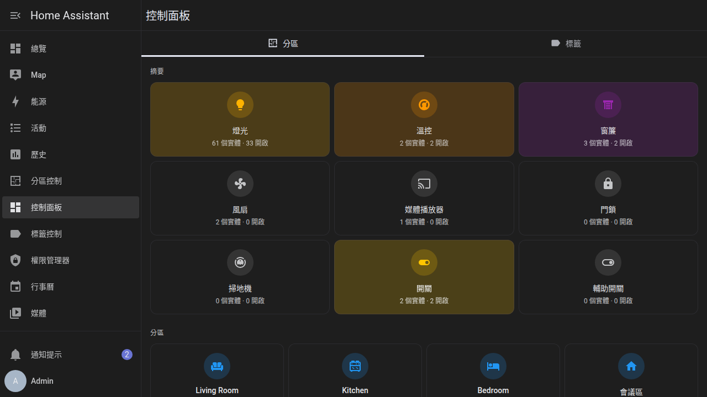
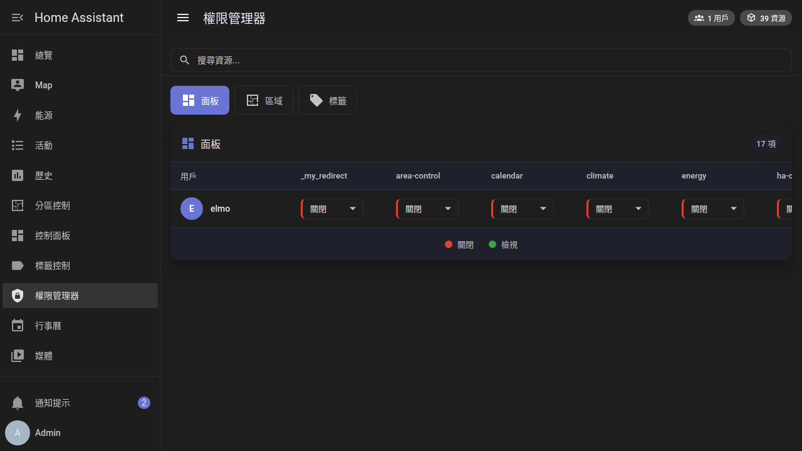

<p align="center">
  
</p>

<h1 align="center">Woow HA Permission Control</h1>

<p align="center">
  <strong>Per-user access control for Home Assistant panels, areas and labels</strong><br/>
  One integration, two panels, no restart needed to change a permission
</p>

<p align="center">
  <a href="#overview">Overview</a> &bull;
  <a href="#the-two-panels">Panels</a> &bull;
  <a href="#installation">Installation</a> &bull;
  <a href="#permission-model">Permission model</a> &bull;
  <a href="#services">Services</a> &bull;
  <a href="#security">Security</a> &bull;
  <a href="#screenshots">Screenshots</a>
</p>

<p align="center">
  <a href="README_zh-TW.md">繁體中文</a>
</p>

---

## Overview

Home Assistant has one visibility model for everyone: every user sees every panel,
every area and every dashboard. This integration adds a per-user one — an admin
decides, per user, which sidebar panels, areas and labels are visible, and
Home Assistant stops handing the rest out.

| Challenge | What this does |
|---|---|
| All users see the same sidebar | Per-user panel visibility — admin tools disappear for regular users |
| No area-level access control | Grant or deny individual areas per user |
| No label-level access control | Grant or deny individual labels per user |
| Lovelace dashboards visible to everyone | A denied dashboard is not in the panel map a browser receives |
| Permissions scattered across integrations | One admin matrix: all users x all resources |
| Changes need a restart | Event-driven — the sidebar updates immediately |

> **Upgrading from the three-integration layout (v1.x)?** `ha_area_control` and
> `ha_label_control` no longer exist. Read [CHANGELOG.md](CHANGELOG.md) first —
> there is a HACS custom-repository step that is easy to miss.

## The two panels

### Permission Manager — `/ha_permission_manager` (admin only)

The admin matrix. Every user against every Resource, in one grid, with tabs for
Panels / Areas / Labels, search, and bulk operations.

### Control Panel — `/ha-control-panel` (all users)

The only device-control surface this integration ships. Areas and Labels are tabs
of the same panel: domain summary cards, domain tabs, search, and 15
domain-specific tiles (lights, climate, covers, media players, locks, ...) that
control entities directly. Every user sees only what they have View permission
for. See [ADR-0002](docs/adr/0002-control-panel-is-the-only-device-control-surface.md)
for why the old separate Area Control and Label Control panels were deleted.

## Installation

### Prerequisites

- Home Assistant **2025.1.0** or newer
- [HACS](https://hacs.xyz/) for the recommended path

### Via HACS

1. HACS -> the three-dot menu -> **Custom repositories**
2. Add `https://github.com/WOOWTECH/Woow_ha_permission_control` (type: **Integration**)
3. Download **Woow HA Permission Control**, then restart Home Assistant
4. Settings -> Devices & Services -> **Add Integration** -> *Permission Manager*

> If you previously added any of `WOOWTECH/hacs-ha_permission_manager`,
> `WOOWTECH/hacs-ha_area_control` or `WOOWTECH/hacs-ha_label_control` as custom
> repositories, **remove them**. They are archived, and HACS will keep serving you
> the old version while they are still listed.

### Manual

```bash
git clone https://github.com/WOOWTECH/Woow_ha_permission_control.git
cp -r Woow_ha_permission_control/custom_components/ha_permission_manager \
  /config/custom_components/
# then restart Home Assistant and add the integration from the UI
```

## Permission model

A **Permission level** is set against a (user, **Resource**) pair. There are
exactly two levels and exactly three kinds of Resource.

| Level | Value | Behaviour |
|---|---|---|
| **View** | `1` | The user can see and open the resource |
| **Closed** | `0` | Not in the panel map at all — no sidebar row, and a typed URL is Home Assistant's own `notfound` |

| Prefix | Resource type | Example |
|---|---|---|
| `panel_` | Sidebar panel | `panel_ha-control-panel` |
| `area_` | Home Assistant area | `area_living_room` |
| `label_` | Home Assistant label | `label_lighting` |

Permissions live in `.storage/ha_permission_manager` and survive restarts and
upgrades. The vocabulary used throughout the code is defined in
[CONTEXT.md](CONTEXT.md).

## Services

14 services cover the full permission CRUD surface, callable from automations,
REST and the WebSocket API. The complete bilingual reference — parameters, YAML,
curl and Python for every service — is in
**[docs/services-guide.md](docs/services-guide.md)**.

```yaml
# Give a user View access to one area
action: ha_permission_manager.set_permission
data:
  user_id: aa4d4d107f79429990c52080056c2715
  resource_id: area_living_room
  level: 1
```

### WebSocket commands

| Command | Who | Purpose |
|---|---|---|
| `permission_manager/get_all_permissions` | any user | the caller's own permissions |
| `permission_manager/get_panel_permissions` | any user | panel visibility for the caller |
| `permission_manager/get_admin_data` | admin | the full matrix |
| `permission_manager/set_permission` | admin | write one permission |
| `area_control/get_permitted_areas` | any user | areas the caller may view |
| `area_control/get_area_entities` | any user | entities of a permitted area |
| `label_control/get_permitted_labels` | any user | labels the caller may view |
| `label_control/get_label_entities` | any user | entities of a permitted label |

The `area_control/*` and `label_control/*` names outlive the domains they came
from, deliberately — see [ADR-0004](docs/adr/0004-websocket-command-names-are-frozen.md).

## Security

Write operations and the full matrix are admin-only; a regular user's WebSocket
connection can read its own permissions and nothing else.

- `set_permission` and `get_admin_data` require the `is_admin` flag
- All WebSocket parameters validated with `voluptuous` schemas
- Only the `panel_`, `area_`, `label_` prefixes are accepted as Resource ids
- Only levels `0` and `1` are accepted
- No raw SQL anywhere; all data access goes through Home Assistant
- The permission store is a `.storage` JSON file, never exposed over HTTP
- The **Panel Gate** wraps Home Assistant's own `get_panels`, so a panel a user
  has no View permission for never reaches their browser at all

> The decision is made in Home Assistant, not in the browser. Since v3.0.0 this
> integration ships no code that hides anything on a page: there is nothing on
> the page to hide. That is not a substitute for Home Assistant's own
> authentication — see the note below on what disabling the integration does.

> **Disabling this integration lifts every restriction.** The Panel Gate hands
> `get_panels` back to Home Assistant when the integration unloads, and every
> user sees every panel again immediately — no restart needed. That is
> deliberate: it is how an administrator recovers an instance they have locked
> themselves out of, and it is the reason the permission model is a way to
> shape what users see rather than a security boundary. Anyone who can disable
> the integration can undo all of it. See
> [ADR-0011](docs/adr/0011-the-panel-decision-moves-into-the-backend.md).

## Screenshots

Control Panel and Permission Manager, in light and dark, across three themes.

| | Control Panel | Permission Manager |
|---|---|---|
| Woow |  |  |
| Woow (dark) |  |  |
| Google |  |  |
| Frosted Glass |  |  |

## Project structure

```
custom_components/ha_permission_manager/
├── __init__.py          setup, panel registration, permission CRUD
├── const.py             domain, prefixes, panel and service names
├── config_flow.py       single-instance config flow
├── discovery.py         finds panels, areas and labels
├── panel_gate.py        the Panel Gate over Home Assistant's get_panels
├── panel_policy.py      which panels a user may receive — the one answer
├── services.py          the 14 services
├── websocket_api.py     the 8 WebSocket commands
├── users.py             user lookup
└── frontend/            the two panels, lit.js and sidebar-title.js,
                         served from /ha_permission_manager_frontend
CONTEXT.md               the glossary — read this before contributing
docs/adr/                why things are the way they are
docs/services-guide.md   the full service reference (EN / 中文)
tests/                   offline suites, plus REST and Playwright verification
```

## Contributing

Read [CONTEXT.md](CONTEXT.md) for the vocabulary and [docs/adr/](docs/adr/) for
the decisions already made. If a change contradicts an ADR, say so in the PR
rather than working around it.

The offline suites need no Home Assistant, and CI runs them on every push:

```bash
node --test tests/*.test.mjs          # the frontend asset graph
python -m pytest tests/test_panel_policy.py tests/test_panel_gate.py tests/test_permission_store.py
```

`tests/frontend_assets.test.mjs` is the one to know about when bumping a
version: `PANEL_VERSION` in `const.py` is the only cache buster, and that test
is what keeps every registered asset and every import specifier moving with it
(see [ADR-0006](docs/adr/0006-a-frontend-asset-carries-its-cache-buster-onto-what-it-pulls-in.md)).
The remaining suites drive a live instance and erase what they point at.

Issues: <https://github.com/WOOWTECH/Woow_ha_permission_control/issues>

## License

[MIT](LICENSE)
