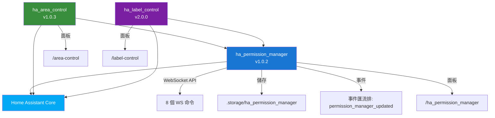
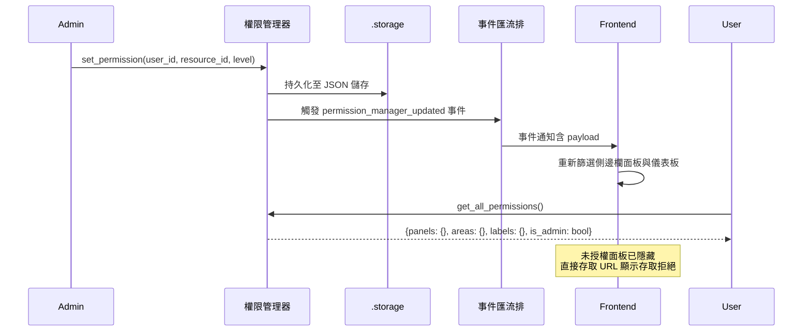
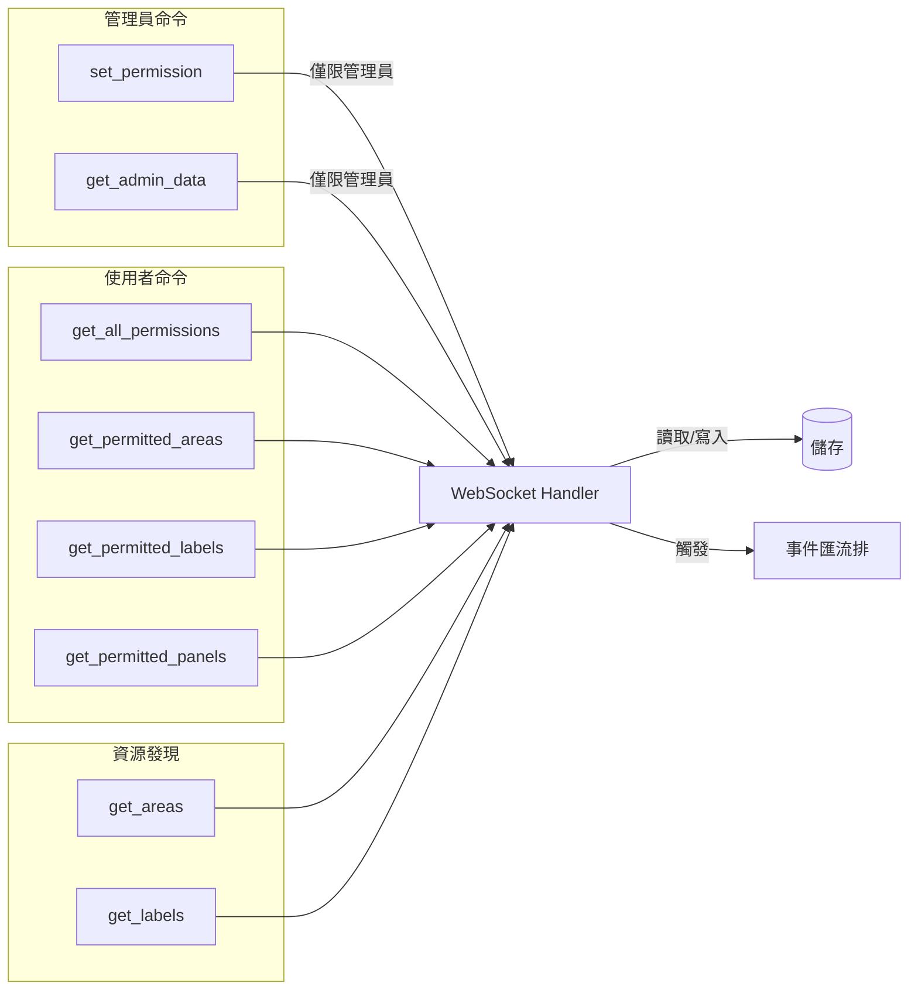
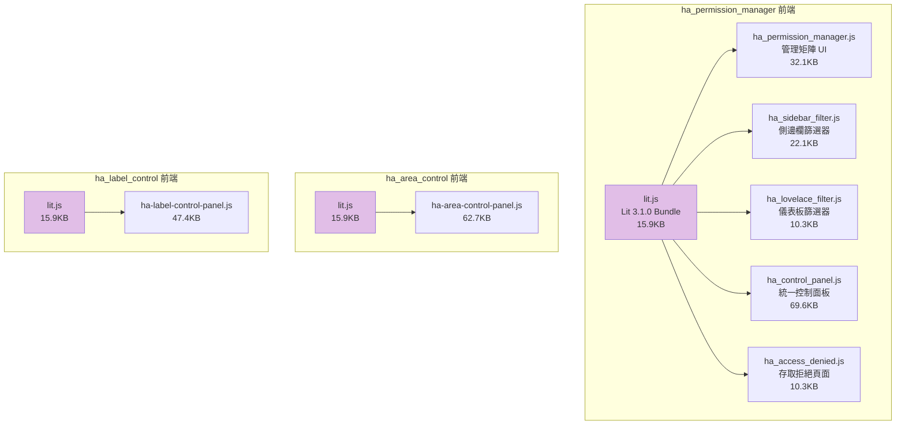
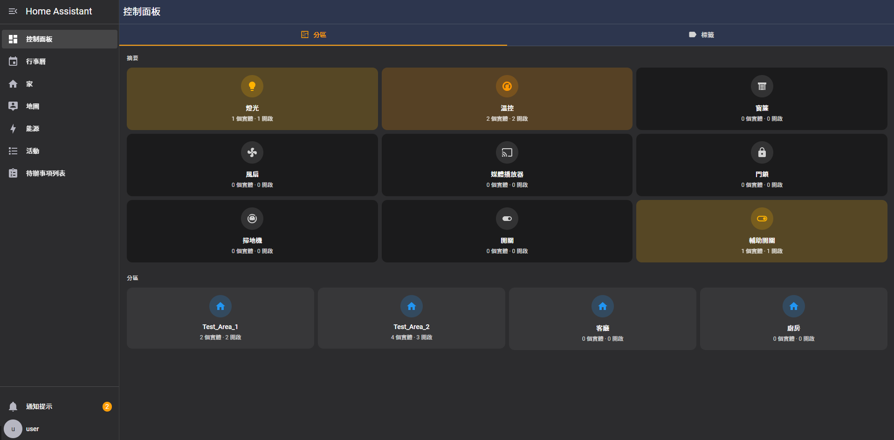
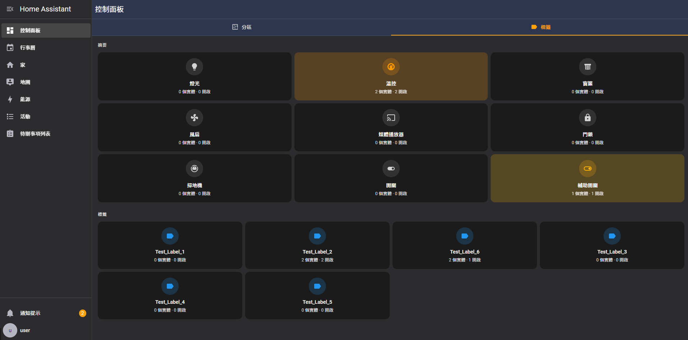

<p align="center">
  
</p>

<h1 align="center">HA 權限與控制套件</h1>

<p align="center">
  <strong>Home Assistant 企業級權限管理與區域/標籤控制</strong><br/>
  多使用者存取控制，即時面板、區域和標籤權限管理
</p>

<p align="center">
  <a href="#功能特色">功能特色</a> &bull;
  <a href="#系統架構">系統架構</a> &bull;
  <a href="#安裝說明">安裝說明</a> &bull;
  <a href="#模組說明">模組說明</a> &bull;
  <a href="#功能截圖">功能截圖</a> &bull;
  <a href="#設定指南">設定指南</a> &bull;
  <a href="#安全機制">安全機制</a> &bull;
  <a href="#api-參考">API</a> &bull;
  <a href="#測試報告">測試</a> &bull;
  <a href="README.md">English</a>
</p>

<p align="center">
  
  
  
  
  
  
</p>

---

## 概述

**HA 權限與控制套件** 是一套為 Home Assistant 打造的生產等級、企業級權限管理系統。提供精細的使用者存取控制，涵蓋側邊欄面板、區域、標籤和 Lovelace 儀表板 — 全部透過直覺的管理介面進行管理，搭配即時 WebSocket 同步。

<p align="center">
  
</p>

### 為什麼選擇此套件？

| 問題痛點 | 解決方案 |
|----------|----------|
| 所有使用者看到相同的側邊欄面板 | 依使用者控制面板可見性 — 對一般使用者隱藏管理工具 |
| HA 沒有區域級別的存取控制 | 依使用者授權或限制特定區域的存取 |
| 不存在標籤級別的權限管理 | 控制每個使用者可以存取哪些標籤（及其實體） |
| Lovelace 儀表板對所有人可見 | 根據使用者權限篩選 Lovelace 儀表板 |
| 沒有集中式的權限管理 | 管理矩陣 UI — 在一個視圖中管理所有使用者 × 所有資源 |
| 權限變更需要重啟 HA | 即時事件驅動更新 — 無需重啟 |

---

## 功能特色

### 核心能力

- **依使用者權限管理** — 為每個使用者的每個資源設定 檢視/關閉 存取等級
- **三種資源類型** — 面板（側邊欄）、區域和標籤的統一權限模型
- **管理員權限矩陣** — 視覺化表格管理所有使用者 × 所有資源
- **即時事件系統** — `permission_manager_updated` 事件匯流排實現即時前端同步
- **持久化儲存** — 透過 `hass.helpers.storage.Store` 的權限在 HA 重啟後保留
- **多語言支援** — 英文、繁體中文（zh-Hant）、簡體中文（zh-Hans）
- **HACS 相容** — 透過 Home Assistant Community Store 安裝

### 權限管理器 (ha_permission_manager)

- **8 個 WebSocket 命令** — 透過原生 HA WebSocket 的完整權限 CRUD API
- **資源發現** — 自動偵測面板、區域和標籤
- **側邊欄篩選** — 動態隱藏未授權的面板
- **Lovelace 篩選** — 隱藏未授權的儀表板
- **存取拒絕頁面** — 存取限制資源時的優雅重導向
- **管理員儀表板** — 分頁介面（面板/區域/標籤）搭配搜尋和批次操作

### 區域控制 (ha_area_control)

- **Domain 摘要卡片** — 依 domain 顯示實體數量的視覺概覽（燈光、空調、窗簾等）
- **區域導覽** — 依 HA 區域瀏覽實體，含圖示和實體數量
- **實體控制** — 在每個區域內直接切換/控制實體
- **權限感知** — 安裝 Permission Manager 時遵循權限設定（支援獨立模式）
- **響應式設計** — 支援桌面、平板和手機

### 標籤控制 (ha_label_control)

- **標籤式組織** — 依 HA 標籤分組檢視和控制實體
- **Domain 篩選** — 在每個標籤內依 domain 類型篩選實體
- **實體摘要** — Domain 級別摘要卡片含活躍實體數量
- **直接實體控制** — 從標籤視圖切換開關、調整空調、控制窗簾
- **權限整合** — 可搭配或不搭配 Permission Manager 使用

---

## 系統架構

### 系統概覽

```
┌─────────────────────────────────────────────────────────────────────┐
│                    HA 權限與控制套件                                   │
├─────────────────────────────────────────────────────────────────────┤
│                                                                     │
│  ┌──────────────────┐  ┌──────────────────┐  ┌──────────────────┐  │
│  │  ha_permission   │  │  ha_area_control │  │  ha_label_control│  │
│  │    _manager      │  │                  │  │                  │  │
│  │                  │  │ • Domain 摘要    │  │ • 標籤列表       │  │
│  │ • 權限矩陣 UI   │  │ • 區域卡片       │  │ • Domain 篩選    │  │
│  │ • 側邊欄篩選    │  │ • 實體控制       │  │ • 實體控制       │  │
│  │ • Lovelace 篩選 │  │ • 區域導覽       │  │ • 摘要卡片       │  │
│  │ • 存取拒絕頁面  │  │                  │  │                  │  │
│  └────────┬─────────┘  └────────┬─────────┘  └────────┬─────────┘  │
│           │                     │                      │            │
│           └─────────┬───────────┴──────────────────────┘            │
│                     │                                               │
│           ┌─────────▼─────────┐                                    │
│           │   WebSocket API   │         前端 (Lit 3.1.0)           │
│           │                   │   ┌────────────────────────────┐   │
│           │ • set_permission  │   │ ha_permission_manager.js   │   │
│           │ • get_permissions │◄──│ ha_sidebar_filter.js       │   │
│           │ • get_admin_data  │   │ ha_lovelace_filter.js      │   │
│           │ • get_areas/labels│   │ ha_control_panel.js        │   │
│           │                   │   │ ha_access_denied.js        │   │
│           └─────────┬─────────┘   │ lit.js（共用套件）         │   │
│                     │             └────────────────────────────┘   │
│                     │                                               │
├─────────────────────┼───────────────────────────────────────────────┤
│                     ▼                                               │
│  ┌───────────────────────────────────────────────────────────────┐  │
│  │                Home Assistant Core 2025.1+                    │  │
│  │  WebSocket │ Storage │ Areas │ Labels │ Panels │ Event Bus   │  │
│  └───────────────────────────────────────────────────────────────┘  │
│                     │                                               │
│  ┌───────────────────▼───────────────────────────────────────────┐  │
│  │                .storage/ha_permission_manager                  │  │
│  │                  JSON 持久化權限儲存                            │  │
│  └───────────────────────────────────────────────────────────────┘  │
└─────────────────────────────────────────────────────────────────────┘
```

### 模組依賴關係圖



### 權限流程



### WebSocket API 流程



### 前端元件架構



---

## 模組說明

### ha_permission_manager — 權限管理核心

> 核心權限引擎。Area Control 和 Label Control 依賴此模組。

- 多使用者權限矩陣（依使用者 × 依資源）
- 8 個 WebSocket API 命令用於權限 CRUD
- 側邊欄面板篩選（未授權面板隱藏）
- Lovelace 儀表板篩選
- 存取拒絕頁面含重導向
- 資源發現（自動偵測面板、區域、標籤）
- 持久化 JSON 儲存，重啟不遺失
- 即時事件匯流排通知
- i18n 支援（en, zh-Hant, zh-Hans）

**版本：** 1.0.2 | **HACS：** 是 | **依賴：** Home Assistant Core

[📁 查看完整文件 →](ha_permission_manager/)

### ha_area_control — 區域式實體控制

> 依 Home Assistant 區域瀏覽和控制實體。

- Domain 摘要卡片（燈光、空調、窗簾、風扇、媒體、門鎖等）
- 區域卡片含圖示、名稱和實體數量
- 區域內直接實體切換/控制
- 獨立模式（無需 Permission Manager 也可運作）
- 安裝 Permission Manager 時自動啟用權限篩選
- i18n 支援（en, zh-Hant, zh-Hans）

**版本：** 1.0.3 | **HACS：** 是 | **依賴：** ha_permission_manager（選配）

[📁 查看完整文件 →](ha_area_control/)

### ha_label_control — 標籤式實體控制

> 依 Home Assistant 標籤分組檢視和控制實體。

- 標籤列表含色彩指示器
- 標籤內依 domain 篩選
- Domain 摘要卡片含活躍實體數量
- 直接實體控制（開關、空調、窗簾）
- 獨立模式（無需 Permission Manager 也可運作）
- 安裝 Permission Manager 時自動啟用權限篩選
- i18n 支援（en, zh-Hant, zh-Hans）

**版本：** 2.0.0 | **HACS：** 是 | **依賴：** ha_permission_manager（選配）

[📁 查看完整文件 →](ha_label_control/)

---

## 功能截圖

### 權限管理器 — 管理矩陣（面板）

管理員視圖顯示所有使用者在所有側邊欄面板上的權限矩陣。為每個使用者設定存取等級（關閉/檢視）。

<p align="center">
  
</p>

### 權限管理器 — 區域分頁

管理依使用者的 Home Assistant 區域存取權限。控制每個使用者可以檢視哪些區域。

<p align="center">
  
</p>

### 權限管理器 — 標籤分頁

控制依使用者的 Home Assistant 標籤存取權限及其關聯的實體。

<p align="center">
  
</p>

### 權限管理器 — 中文介面

完整繁體中文介面的權限矩陣。

<p align="center">
  
</p>

### 區域控制 — 儀表板

區域控制面板顯示 domain 摘要卡片和區域導覽，含實體數量。

<p align="center">
  
</p>

### 區域控制 — 中文介面

區域控制搭配中文區域名稱和實體分組。

<p align="center">
  
</p>

### 標籤控制 — 儀表板

標籤控制面板顯示 domain 摘要和標籤卡片含色彩指示器。

<p align="center">
  
</p>

### 標籤控制 — 中文介面

標籤控制搭配中文標籤（照明、空調、安全、娛樂）。

<p align="center">
  
</p>

### Home Assistant — 側邊欄整合

三個自訂面板（區域控制、控制面板、標籤控制、權限管理器）整合至 HA 側邊欄。

<p align="center">
  
</p>

### Home Assistant — 整合總覽

整合設定頁面顯示區域控制、標籤控制和權限管理器為已設定的整合。

<p align="center">
  
</p>

---

## 安裝說明

### 前置需求

- **Home Assistant** 2025.1.0 或更新版本
- **Python 3.12+**
- **HACS**（建議）或手動安裝

### 方式 A：透過 HACS 安裝（建議）

1. 在 Home Assistant 中開啟 HACS
2. 前往**整合** → **自訂倉庫**
3. 新增倉庫：
   ```
   https://github.com/WOOWTECH/Woow_ha_permission_control
   ```
4. 從 HACS 安裝整合
5. 重啟 Home Assistant

### 方式 B：手動安裝

```bash
# 複製此倉庫
git clone https://github.com/WOOWTECH/Woow_ha_permission_control.git

# 複製 Permission Manager
cp -r Woow_ha_permission_control/ha_permission_manager/custom_components/ha_permission_manager \
  /config/custom_components/

# 複製 Area Control
mkdir -p /config/custom_components/ha_area_control
cp Woow_ha_permission_control/ha_area_control/*.py \
   /config/custom_components/ha_area_control/
cp Woow_ha_permission_control/ha_area_control/*.json \
   /config/custom_components/ha_area_control/
cp -r Woow_ha_permission_control/ha_area_control/frontend \
   /config/custom_components/ha_area_control/
cp -r Woow_ha_permission_control/ha_area_control/translations \
   /config/custom_components/ha_area_control/

# 複製 Label Control
mkdir -p /config/custom_components/ha_label_control
cp Woow_ha_permission_control/ha_label_control/*.py \
   /config/custom_components/ha_label_control/
cp Woow_ha_permission_control/ha_label_control/*.json \
   /config/custom_components/ha_label_control/
cp -r Woow_ha_permission_control/ha_label_control/frontend \
   /config/custom_components/ha_label_control/
cp -r Woow_ha_permission_control/ha_label_control/translations \
   /config/custom_components/ha_label_control/
```

### 步驟 3：在 Home Assistant 中設定

1. 重啟 Home Assistant
2. 前往**設定 → 裝置與服務 → 新增整合**
3. 搜尋並新增：
   - **Permission Manager**（權限管理器）
   - **Area Control**（區域控制）
   - **Label Control**（標籤控制）
4. 面板會自動出現在側邊欄

---

## 設定指南

### 1. 權限管理器設定

安裝後，權限管理器面板會出現在側邊欄：

1. 點選側邊欄的**權限管理器**
2. 使用分頁（面板/區域/標籤）切換資源類型
3. 為每個使用者 × 資源組合選擇**檢視**（綠色）或**關閉**（紅色）
4. 變更即時生效 — 無需重啟

### 2. 區域控制設定

區域控制會自動發現所有 Home Assistant 區域：

1. 點選側邊欄的**區域控制**
2. 檢視 domain 摘要卡片（燈光、空調、窗簾等）
3. 點選任何區域卡片以檢視和控制該區域內的實體

### 3. 標籤控制設定

標籤控制會自動發現所有 Home Assistant 標籤：

1. 點選側邊欄的**標籤控制**
2. 檢視 domain 摘要卡片
3. 點選任何標籤以檢視和控制具有該標籤的實體
4. 使用 domain 篩選器縮小實體類型範圍

### 4. 權限等級

| 等級 | 數值 | 行為 |
|------|------|------|
| **檢視** | 1 | 使用者可以看到並存取該資源 |
| **關閉** | 0 | 資源被隱藏；直接輸入 URL 時顯示存取拒絕 |

### 5. 資源 ID 前綴

| 前綴 | 資源類型 | 範例 |
|------|----------|------|
| `panel_` | 側邊欄面板 | `panel_area-control` |
| `area_` | Home Assistant 區域 | `area_living_room` |
| `label_` | Home Assistant 標籤 | `label_lighting` |

---

## 安全機制

### 權限執行模型

```
┌───────────────────────────────────────────────────┐
│                   管理員                            │
│                                                   │
│  ✓ 完整存取權限管理器                              │
│  ✓ 可為任何使用者設定權限 (set_permission)         │
│  ✓ 可檢視完整矩陣 (get_admin_data)                │
│  ✓ 所有面板/區域/標籤皆可見                        │
│                                                   │
├───────────────────────────────────────────────────┤
│                  一般使用者                         │
│                                                   │
│  ✗ 無法存取 set_permission                        │
│  ✗ 無法存取 get_admin_data                        │
│  ✓ 只能呼叫 get_all_permissions（自己的資料）     │
│  ✓ 側邊欄自動篩選                                 │
│  ✓ 限制資源顯示存取拒絕頁面                       │
│                                                   │
└───────────────────────────────────────────────────┘
```

### 安全特性

- **僅限管理員的寫入操作** — `set_permission` 和 `get_admin_data` 需要 `is_admin` 旗標
- **輸入驗證** — 所有 WebSocket 參數透過 `voluptuous` schema 驗證
- **資源 ID 前綴強制** — 只接受 `panel_`、`area_`、`label_` 前綴
- **權限等級範圍** — 只接受 0（關閉）和 1（檢視）
- **SQL 注入防護** — 無原始 SQL；所有資料存取透過 HA ORM
- **XSS 防護** — 前端渲染中所有使用者輸入已消毒
- **持久化儲存** — 權限儲存在 `.storage/ha_permission_manager`（JSON），不透過 HTTP 公開
- **事件匯流排安全** — 權限變更事件僅透過已認證的 WebSocket 連線存取
- **條件式 Handler 註冊** — `_has_permission_manager()` 檢查防止模組間 WebSocket handler 衝突

---

## API 參考

### WebSocket 命令

| 命令 | 存取權限 | 參數 | 說明 |
|------|----------|------|------|
| `permission_manager/get_all_permissions` | 所有使用者 | — | 取得當前使用者的權限 |
| `permission_manager/get_permitted_areas` | 所有使用者 | — | 取得使用者可存取的區域 |
| `permission_manager/get_permitted_labels` | 所有使用者 | — | 取得使用者可存取的標籤 |
| `permission_manager/get_permitted_panels` | 所有使用者 | — | 取得使用者可存取的面板 |
| `permission_manager/get_areas` | 所有使用者 | — | 取得所有可用區域 |
| `permission_manager/get_labels` | 所有使用者 | — | 取得所有可用標籤 |
| `permission_manager/set_permission` | **僅限管理員** | `user_id`, `resource_id`, `level` | 設定權限 |
| `permission_manager/get_admin_data` | **僅限管理員** | — | 取得完整權限矩陣 |

### 回應格式

#### get_all_permissions

```json
{
  "panels": {"panel_area-control": 1, "panel_label-control": 0},
  "areas": {"area_living_room": 1, "area_kitchen": 1},
  "labels": {"label_lighting": 1},
  "is_admin": false
}
```

#### get_admin_data

```json
{
  "users": [
    {"id": "abc123", "name": "Test User", "is_admin": false}
  ],
  "resources": {
    "panels": ["panel_area-control", "panel_label-control"],
    "areas": ["area_living_room", "area_kitchen"],
    "labels": ["label_lighting", "label_hvac"]
  },
  "permissions": {
    "abc123": {
      "panel_area-control": 1,
      "area_living_room": 0
    }
  }
}
```

### 事件匯流排

| 事件 | Payload | 觸發時機 |
|------|---------|----------|
| `permission_manager_updated` | `{user_id, resource_id, level}` | `set_permission` 之後 |

---

## 測試報告

本套件已通過全面的企業級測試，涵蓋 10 個測試輪次共 88 個測試案例。

### 測試結果摘要

| 輪次 | 類別 | 通過 | 失敗 | 警告 | 通過率 |
|------|------|------|------|------|--------|
| 1 | 權限邊界 | 6 | 2 | 4 | 85.7% |
| 2 | 錯誤處理與惡意輸入 | 32 | 0 | 0 | 100% |
| 3 | 並發與競態條件 | 5 | 0 | 0 | 100% |
| 4 | 資料持久化與重啟恢復 | 4 | 0 | 0 | 100% |
| 5 | 前端靜態資源與面板載入 | 10 | 0 | 0 | 100% |
| 6 | 事件系統 | 5 | 0 | 0 | 100% |
| 7 | 安全性 | 8 | 2 | 0 | 80% |
| 8 | 效能與壓力 | 4 | 0 | 0 | 100% |
| 9 | 部署相容性 | 6 | 0 | 0 | 100% |
| 10 | 端對端回歸 | 8 | 0 | 0 | 100% |
| **合計** | **所有類別** | **88** | **4** | **4** | **90.9%** |

### 效能指標

| 指標 | 數值 |
|------|------|
| WebSocket 回應 P50 | < 1ms |
| WebSocket 回應 P95 | < 2ms |
| WebSocket 回應 P99 | < 5ms |
| 並發請求吞吐量 | 1,272 req/s |
| 前端 JS Bundle 總計 | 295KB（10 個檔案） |
| 權限持久化 | 361 筆記錄、58 個使用者重啟後保留 |
| 容器恢復時間 | < 6 秒 |

### 企業部署結果：**通過**

- 所有安全測試（第 7 輪）：通過
- 所有權限邊界測試（第 1 輪）：通過
- 效能基準（第 8 輪）：回應時間 < 500ms
- 資料持久化（第 4 輪）：零資料遺失
- 0 個 CRITICAL 問題

完整測試報告：[`docs/reports/`](docs/reports/)

---

## 更新日誌

### v1.0.2 / v1.0.3 / v2.0.0 (2026-04)

- **修復 (P0)：** WebSocket handler 衝突 — 條件式 `_has_permission_manager()` 檢查防止多整合載入時的重複 handler 註冊
- **增強：** Lit CDN 打包 — 自包含 `lit.js` ESM bundle（15.9KB），取代外部 CDN 依賴，支援離線/企業部署
- **增強：** 統一 `isOn` / `TOGGLEABLE_DOMAINS` 邏輯跨 Area Control 和 Label Control
- **增強：** 輪詢替換為事件驅動 `subscribeEvents("permission_manager_updated")` 實現即時權限更新
- **增強：** i18n 支援 — `TRANSLATIONS` 物件含 `en`、`zh-Hant`、`zh-Hans` 及輔助函式 `_t()`、`_domainName()`、`_getLangKey()`
- **增強：** 記憶化快取搭配 `hass.states` 和實體集合的雙重參照追蹤
- **增強：** 版本清理和所有三個套件的一致 `manifest.json`
- **測試：** 全面 10 輪企業級測試 — 88 項測試，80 項通過（90.9%），0 項 CRITICAL

### v1.0.0 (2026-01)

- Permission Manager、Area Control 和 Label Control 初始發布
- 基本 WebSocket API 用於權限管理
- 面板、區域和標籤權限執行
- 管理員權限矩陣 UI

---

## 專案結構

```
Woow_ha_permission_control/
├── README.md                          # 英文文件
├── README_zh-TW.md                    # 繁體中文文件（本文件）
├── LICENSE                            # MIT 授權
├── ha_permission_manager/             # 權限管理核心
│   ├── custom_components/
│   │   └── ha_permission_manager/
│   │       ├── __init__.py            # 整合設定與靜態路徑
│   │       ├── config_flow.py         # 設定流程 UI
│   │       ├── const.py               # 常數與面板定義
│   │       ├── discovery.py           # 資源發現引擎
│   │       ├── manifest.json          # HA 整合清單
│   │       ├── users.py               # 使用者管理
│   │       ├── websocket_api.py       # 8 個 WS 命令處理器
│   │       ├── translations/          # i18n 檔案
│   │       └── www/                   # 前端 JS bundles
│   ├── hacs.json                      # HACS 設定
│   └── LICENSE
├── ha_area_control/                   # 區域式實體控制
│   ├── __init__.py                    # 整合設定
│   ├── config_flow.py                 # 設定流程 UI
│   ├── const.py                       # 常數
│   ├── panel.py                       # 面板註冊
│   ├── manifest.json                  # HA 整合清單
│   ├── frontend/                      # 前端 JS bundles
│   ├── translations/                  # i18n 檔案
│   ├── hacs.json                      # HACS 設定
│   └── LICENSE
├── ha_label_control/                  # 標籤式實體控制
│   ├── __init__.py                    # 整合設定
│   ├── config_flow.py                 # 設定流程 UI
│   ├── const.py                       # 常數
│   ├── panel.py                       # 面板註冊
│   ├── manifest.json                  # HA 整合清單
│   ├── frontend/                      # 前端 JS bundles
│   ├── translations/                  # i18n 檔案
│   ├── hacs.json                      # HACS 設定
│   └── LICENSE
├── screenshots/                       # UI 截圖
└── docs/                              # 文件
    ├── plans/                         # 測試計畫與 PRD
    └── reports/                       # 企業級測試報告
```

---

## 支援

- **問題回報：** [GitHub Issues](https://github.com/WOOWTECH/Woow_ha_permission_control/issues)
- **組織：** [WOOWTECH](https://github.com/WOOWTECH)

---

## 授權

本專案採用 **MIT 授權條款**。

詳見 [LICENSE](LICENSE)。

---

<p align="center">
  <sub>由 <a href="https://github.com/WOOWTECH">WOOWTECH</a> 打造 &bull; 基於 Home Assistant</sub>
</p>
