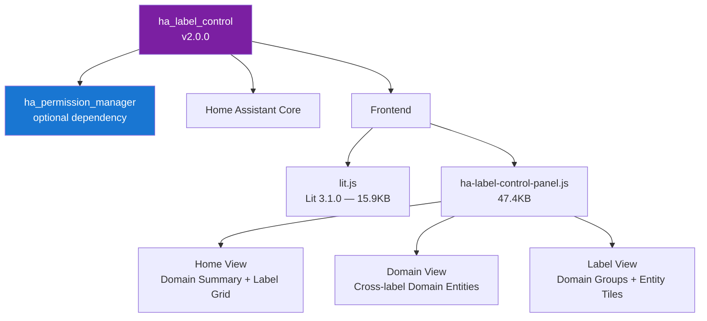

<p align="center">
  
</p>

<h1 align="center">Home Assistant Label Control</h1>

<p align="center">
  <strong>View and control entities grouped by Home Assistant labels with domain filtering</strong>
</p>

<p align="center">
  <a href="#features">Features</a> &bull;
  <a href="#screenshots">Screenshots</a> &bull;
  <a href="#installation">Installation</a> &bull;
  <a href="#websocket-api">API</a> &bull;
  <a href="#architecture">Architecture</a> &bull;
  <a href="README_CN.md">简体中文</a>
</p>

<p align="center">
  
  
  
  
  
</p>

> **Part of the [HA Permission & Control Suite](../)** — works standalone or with [Permission Manager](../ha_permission_manager/) for per-user label filtering.

---

## Overview

A Home Assistant custom component that provides a sidebar panel for controlling entities organized by labels. Features an intuitive three-view architecture with domain summary cards, label navigation with color indicators, and interactive entity tiles supporting 17 device domains.

---

## Features

- **Label-based Entity Control** — View and control entities grouped by their assigned labels
- **Permission-aware** — Integrates with Permission Manager to show only permitted labels (standalone mode supported)
- **Multi-language Support** — English, Traditional Chinese (zh-Hant), and Simplified Chinese (zh-Hans)
- **Native HA Style UI** — Clean, responsive interface matching Home Assistant's modern design
- **Domain Summary Dashboard** — 3x3 grid showing 9 domain categories (Lights, Climate, Covers, Fans, Media, Locks, Vacuums, Switches, Input Boolean)
- **Domain Detail View** — Click domain summary cards to see entities grouped by labels
- **Label Detail View** — Click label cards to see entities grouped by domain
- **Color Indicators** — Labels display with their assigned HA colors
- **Interactive Entity Tiles** — Brightness sliders for lights, temperature controls for climate, cover buttons, and more
- **Real-time Updates** — Entity states update in real-time via `hass.states` subscription
- **Optimized Performance** — Parallel data loading for fast initial render
- **Self-contained Lit 3.1.0** — Bundled ESM module (15.9KB), no CDN dependency
- **Memoization Cache** — Dual-reference tracking for hass.states and labelEntities collections
- **Event-driven Sync** — Subscribes to `permission_manager_updated` events when Permission Manager is available (no polling)
- **Conditional Handler Registration** — Skips standalone WebSocket handler when `ha_permission_manager` is loaded to avoid collision

---

## Screenshots

### Home View — Domain Summary + Label Cards

<p align="center">
  
</p>

### Chinese Interface

Labels with Chinese names (照明, 空調, 安全, 娛樂) and domain summaries.

<p align="center">
  
</p>

### Three-View Architecture

1. **Home View** — Domain summary section (3x3 grid) + Label cards with color indicators and entity counts
2. **Domain View** — Click a domain summary card to see all entities of that domain grouped by labels
3. **Label View** — Click a label card to see all entities with that label, organized by domain

---

## Supported Domains

The panel supports **17 entity domains** with specialized tile controls:

| Domain | Features |
|--------|----------|
| `light` | Toggle, brightness slider, RGB color |
| `climate` | Toggle, temperature +/- buttons |
| `cover` | Open/Stop/Close buttons, position |
| `fan` | Toggle, speed slider |
| `media_player` | Previous/Play-Pause/Next |
| `lock` | Lock/Unlock buttons |
| `vacuum` | Start/Pause/Return |
| `switch` | Toggle |
| `input_boolean` | Toggle |
| `scene` | Activate |
| `script` | Activate |
| `automation` | Toggle enable/disable |
| `sensor` | Display value with unit |
| `binary_sensor` | Display state |
| `button` | Press action |
| `humidifier` | Toggle, humidity slider |
| `input_number` | Value display |

---

## Requirements

- Home Assistant **2024.1.0** or newer
- [Permission Manager](../ha_permission_manager/) integration (optional — works standalone)

---

## Installation

### HACS (Recommended)

1. Open HACS in Home Assistant
2. Click the three dots → **Custom repositories**
3. Add `https://github.com/WOOWTECH/Woow_ha_permission_control` as **Integration**
4. Search for "Label Control" and install
5. Restart Home Assistant

### Manual Installation

1. Download the latest release from the [releases page](https://github.com/WOOWTECH/Woow_ha_permission_control/releases)
2. Copy the contents to `custom_components/ha_label_control/` in your HA config directory
3. Restart Home Assistant

### From Consolidated Repository

```bash
git clone https://github.com/WOOWTECH/Woow_ha_permission_control.git
mkdir -p /config/custom_components/ha_label_control
cp Woow_ha_permission_control/ha_label_control/*.py \
   Woow_ha_permission_control/ha_label_control/*.json \
   /config/custom_components/ha_label_control/
cp -r Woow_ha_permission_control/ha_label_control/frontend \
   Woow_ha_permission_control/ha_label_control/translations \
   /config/custom_components/ha_label_control/
```

---

## Configuration

1. Go to **Settings** > **Devices & Services**
2. Click **+ Add Integration**
3. Search for "Label Control"
4. Click to add it

After installation, a new **Label Control** panel will appear in your sidebar.

---

## How It Works

### For Admin Users
Admin users see all labels defined in Home Assistant with full access.

### For Non-Admin Users
When Permission Manager is installed, non-admin users see only the labels they have been granted access to:

| Level | Value | Description |
|-------|-------|-------------|
| **Closed** | 0 | Label hidden from user |
| **View** | 1 | Label visible, entities accessible |

### Standalone Mode
Without Permission Manager installed, all users see all labels (no filtering).

---

## WebSocket API

The integration exposes two WebSocket commands:

| Command | Description |
|---------|-------------|
| `label_control/get_permitted_labels` | Returns labels the current user can access |
| `label_control/get_label_entities` | Returns entities grouped by domain for a specific label |

> **Note:** When `ha_permission_manager` is loaded, Label Control skips registering its own WebSocket handlers to avoid collision — it uses the Permission Manager's handlers instead.

---

## Architecture



### File Structure

```
ha_label_control/
├── __init__.py           # Integration setup, conditional handler registration
├── manifest.json         # Component manifest (v2.0.0)
├── config_flow.py        # Configuration flow
├── const.py              # Constants (DOMAIN, PANEL_VERSION, PANEL_URL)
├── panel.py              # WebSocket API handlers + panel registration
├── strings.json          # Default strings
├── frontend/
│   ├── lit.js            # Lit 3.1.0 ESM bundle (self-contained)
│   └── ha-label-control-panel.js  # Full frontend panel (47.4KB)
├── translations/
│   ├── en.json           # English
│   ├── zh-Hant.json      # Traditional Chinese
│   └── zh-Hans.json      # Simplified Chinese
├── docs/
│   └── plans/
│       └── 2026-01-28-native-ui-redesign-prd.md
├── hacs.json             # HACS configuration
├── LICENSE               # MIT License
├── README.md             # English documentation (this file)
└── README_CN.md          # Simplified Chinese documentation
```

---

## Changelog

### v2.0.0 (2026-04)

- **Fix (P0):** Conditional `_has_permission_manager()` check — skips standalone WebSocket handler registration when Permission Manager is loaded, preventing handler collision
- **Enhancement:** Bundled Lit 3.1.0 locally (15.9KB ESM) — no CDN dependency
- **Enhancement:** Unified `isOn` / `TOGGLEABLE_DOMAINS` logic (covers `climate`, `humidifier`)
- **Enhancement:** Replaced polling with event-driven `subscribeEvents("permission_manager_updated")`
- **Enhancement:** i18n support with `TRANSLATIONS` object (`en`, `zh-Hant`, `zh-Hans`) and `_t()`, `_domainName()`, `_getLangKey()` helpers
- **Enhancement:** Memoization cache with dual-reference tracking for `hass.states` and `labelEntities`
- **Enhancement:** Synchronized `PANEL_VERSION` with `manifest.json`
- **Enhancement:** Removed obsolete permission constants

### v1.0.0 (2026-01)

- Initial release
- Label-based entity control with permission awareness
- Domain summary dashboard, label cards, interactive entity tiles

---

## Related Packages

| Package | Description | Link |
|---------|-------------|------|
| **ha_permission_manager** | Core permission management | [View](../ha_permission_manager/) |
| **ha_area_control** | Area-based entity control panel | [View](../ha_area_control/) |
| **Suite Root** | Full docs, screenshots & architecture | [View](../) |

---

## License

This project is licensed under the MIT License — see the [LICENSE](LICENSE) file for details.

---

<p align="center">
  <sub>Built by <a href="https://github.com/WOOWTECH">WOOWTECH</a> &bull; Powered by Home Assistant</sub>
</p>
