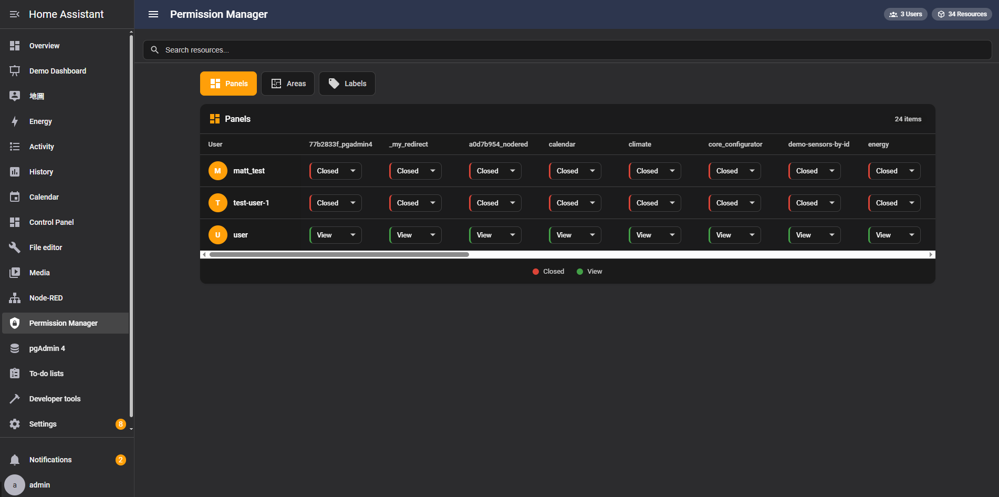
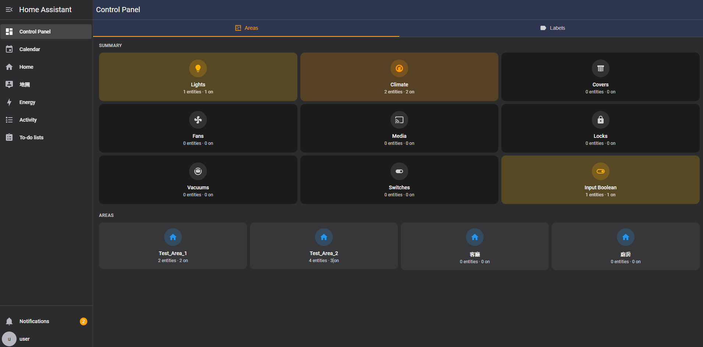
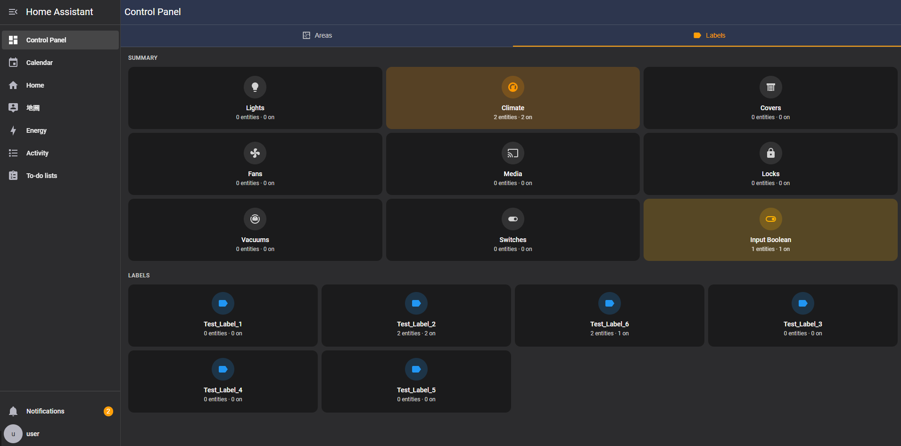
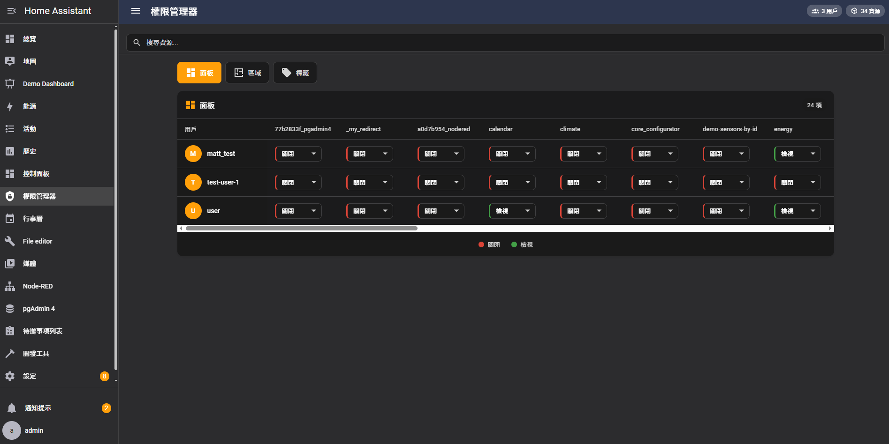
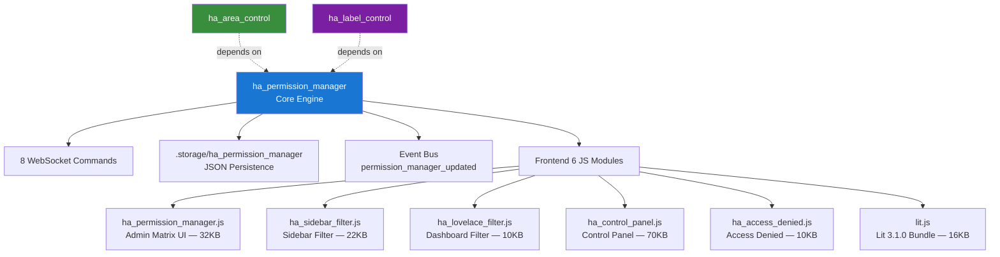

<p align="center">
  
</p>

<h1 align="center">Permission Manager for Home Assistant</h1>

<p align="center">
  <strong>Granular per-user permission management for Home Assistant panels, areas, and labels</strong>
</p>

<p align="center">
  <a href="#features">Features</a> &bull;
  <a href="#screenshots">Screenshots</a> &bull;
  <a href="#installation">Installation</a> &bull;
  <a href="#websocket-api">API</a> &bull;
  <a href="#architecture">Architecture</a> &bull;
  <a href="README_zh.md">繁體中文</a>
</p>

<p align="center">
  
  
  
  
  
  
</p>

> **Part of the [HA Permission & Control Suite](https://github.com/WOOWTECH/Woow_ha_permission_control)** — this is the core module. See the consolidated repository for full documentation, architecture diagrams, and enterprise test reports.

---

## Overview

A Home Assistant custom integration that provides granular permission management for non-admin users. Control which sidebar panels, areas, and labels each user can access — all from a visual admin interface with real-time WebSocket synchronization.

---

## Features

- **Panel Permissions** — Show or hide sidebar panels per user (dashboards, add-ons, tools, etc.)
- **Area Permissions** — Control which areas and their entities are visible to each user
- **Label Permissions** — Control which labels and their entities are visible to each user
- **Permission Matrix** — Visual admin panel with a spreadsheet-style matrix for quick configuration
- **Control Panel** — Unified dashboard showing area/label summaries with entity counts
- **Real-time Enforcement** — Event-driven `permission_manager_updated` event bus for instant frontend updates (no polling)
- **Sidebar Filtering** — JavaScript-based sidebar panel filtering applied immediately
- **Lovelace Filtering** — Hide unauthorized Lovelace dashboards from navigation
- **Access Denied Pages** — Friendly redirect when users navigate to restricted panels
- **Store-based Persistence** — Permissions stored in `.storage/ha_permission_manager` (JSON, no entity pollution)
- **Event-driven Cleanup** — Automatically removes permissions when users/resources are deleted
- **Conditional Handler Registration** — `_has_permission_manager()` check prevents WebSocket handler collision with Area/Label Control
- **i18n Support** — English, Traditional Chinese (zh-Hant) with `TRANSLATIONS` object and `_t()` / `_getLangKey()` helpers
- **Self-contained Lit 3.1.0** — Bundled ESM module (15.9KB), no CDN dependency — works in air-gapped/enterprise environments

---

## Screenshots

### Permission Matrix — Panels Tab

Manage all user permissions from a single spreadsheet-style interface. Toggle each user's access level (Closed/View) per panel.

<p align="center">
  
</p>

### Control Panel — Areas

View area summaries with entity counts grouped by domain:

<p align="center">
  
</p>

### Control Panel — Labels

View label summaries with entity statistics:

<p align="center">
  
</p>

### Chinese Interface

<p align="center">
  
</p>

---

## Requirements

- Home Assistant **2025.1.0** or newer
- At least one non-admin user to manage

---

## Installation

### HACS (Recommended)

1. Open HACS in your Home Assistant instance
2. Click the three-dot menu in the top right and select **Custom repositories**
3. Add `https://github.com/WOOWTECH/ha_permission_manager` as an **Integration**
4. Search for **Permission Manager** and click **Download**
5. Restart Home Assistant

### Manual

1. Download the `custom_components/ha_permission_manager` folder from this repository
2. Copy it to your Home Assistant `config/custom_components/` directory
3. Restart Home Assistant

### From Consolidated Repository

```bash
git clone https://github.com/WOOWTECH/Woow_ha_permission_control.git
cp -r Woow_ha_permission_control/ha_permission_manager/custom_components/ha_permission_manager \
  /config/custom_components/
```

---

## Configuration

1. Go to **Settings** > **Devices & Services**
2. Click **Add Integration** and search for **Permission Manager**
3. Follow the setup wizard — it will create the necessary storage and register the admin panels

No YAML configuration is required.

---

## Dashboards

After installation, the integration automatically creates two dashboards:

### Permission Control Panel (Admin Only)

A management dashboard visible **only to admin users**. Administrators can configure permissions across three tabs:

- **Panels** — Control which sidebar items (dashboards, add-ons, tools, etc.) each user can access
- **Areas** — Control which areas each user can see in the Control Panel dashboard
- **Labels** — Control which labels each user can see in the Control Panel dashboard

### Control Panel

A dashboard visible to **both admin and non-admin users**. It displays area and label summaries with entity counts, filtered by each user's permissions.

---

## Permission Levels

| Level | Value | Description |
|-------|-------|-------------|
| **Closed** | 0 | Resource is hidden from the user |
| **View** | 1 | Resource is visible to the user |

### Resource ID Prefixes

| Prefix | Resource Type | Example |
|--------|---------------|---------|
| `panel_` | Sidebar panel | `panel_area-control` |
| `area_` | Home Assistant area | `area_living_room` |
| `label_` | Home Assistant label | `label_lighting` |

### Admin Users

Admin users always have full access — their permissions are not enforced. The Permission Manager panel itself is only visible to admin users.

---

## WebSocket API

The integration provides **8 WebSocket commands**:

| Command | Access | Parameters | Description |
|---------|--------|------------|-------------|
| `permission_manager/get_all_permissions` | All users | — | Get current user's permissions |
| `permission_manager/get_permitted_areas` | All users | — | Get areas the user can access |
| `permission_manager/get_permitted_labels` | All users | — | Get labels the user can access |
| `permission_manager/get_permitted_panels` | All users | — | Get panels the user can access |
| `permission_manager/get_areas` | All users | — | Get all available areas |
| `permission_manager/get_labels` | All users | — | Get all available labels |
| `permission_manager/set_permission` | **Admin only** | `user_id`, `resource_id`, `level` | Set a permission |
| `permission_manager/get_admin_data` | **Admin only** | — | Get full permission matrix |

### Response: get_all_permissions

```json
{
  "panels": {"panel_area-control": 1, "panel_label-control": 0},
  "areas": {"area_living_room": 1, "area_kitchen": 1},
  "labels": {"label_lighting": 1},
  "is_admin": false
}
```

### Response: get_admin_data

```json
{
  "users": [{"id": "abc123", "name": "Test User", "is_admin": false}],
  "resources": {
    "panels": ["panel_area-control", "panel_label-control"],
    "areas": ["area_living_room"],
    "labels": ["label_lighting"]
  },
  "permissions": {
    "abc123": {"panel_area-control": 1, "area_living_room": 0}
  }
}
```

### Event Bus

| Event | Payload | Trigger |
|-------|---------|---------|
| `permission_manager_updated` | `{user_id, resource_id, level}` | After `set_permission` |

---

## Architecture



### File Structure

```
ha_permission_manager/
├── custom_components/
│   └── ha_permission_manager/
│       ├── __init__.py            # Integration setup, static paths, event handlers
│       ├── config_flow.py         # Config flow UI
│       ├── const.py               # Constants, panel definitions, resource prefixes
│       ├── discovery.py           # Resource discovery engine (panels, areas, labels)
│       ├── manifest.json          # HA integration manifest (v1.0.2)
│       ├── strings.json           # Default i18n strings
│       ├── users.py               # User management and admin detection
│       ├── websocket_api.py       # 8 WebSocket command handlers + voluptuous validation
│       ├── translations/
│       │   ├── en.json
│       │   └── zh-Hant.json
│       └── www/                   # Frontend bundles (served via StaticPathConfig)
│           ├── lit.js             # Lit 3.1.0 ESM bundle (self-contained)
│           ├── ha_permission_manager.js   # Admin matrix UI
│           ├── ha_sidebar_filter.js       # Sidebar panel filter
│           ├── ha_lovelace_filter.js      # Lovelace dashboard filter
│           ├── ha_control_panel.js        # Unified control panel
│           └── ha_access_denied.js        # Access denied redirect page
├── hacs.json                      # HACS integration configuration
├── screenshots/                   # UI screenshots (6 files, EN + ZH)
├── LICENSE                        # MIT License
├── README.md                      # English documentation (this file)
└── README_zh.md                   # Traditional Chinese documentation
```

---

## Security

- **Admin-Only Write Operations** — `set_permission` and `get_admin_data` require `is_admin`
- **Input Validation** — All parameters validated via `voluptuous` schemas
- **Resource ID Prefix Enforcement** — Only `panel_`, `area_`, `label_` accepted
- **Permission Level Range** — Only 0 (Closed) and 1 (View) accepted
- **No Raw SQL** — All data through HA Storage API
- **XSS Prevention** — User input sanitized in frontend rendering
- **Event Bus Security** — Events only via authenticated WebSocket

---

## Changelog

### v1.0.2 (2026-04)

- **Fix (P0):** Conditional `_has_permission_manager()` handler registration — prevents WebSocket handler collision when Area/Label Control load alongside Permission Manager
- **Enhancement:** Replaced polling with event-driven `subscribeEvents("permission_manager_updated")` for instant frontend sync
- **Enhancement:** Bundled Lit 3.1.0 locally (15.9KB ESM) — no CDN dependency
- **Enhancement:** i18n `TRANSLATIONS` object with `_t()`, `_domainName()`, `_getLangKey()` helpers
- **Enhancement:** Memoization cache with dual-reference tracking for `hass.states` and entity collections
- **Testing:** Enterprise-grade 10-round test — 88 tests, 80 PASS (90.9%), 0 CRITICAL

### v1.0.0 (2026-01)

- Initial release
- Permission matrix UI, sidebar/lovelace filtering, access denied pages
- WebSocket API, persistent storage, event-driven cleanup

---

## Troubleshooting

**Panel not appearing in sidebar after installation:**
Restart Home Assistant and clear your browser cache.

**Permission changes not taking effect:**
Changes are applied in real-time via the event bus. Try refreshing the browser. If using a CDN or reverse proxy, invalidate cached pages.

**Users can still see restricted content briefly:**
The sidebar filter script runs after page load. A brief loading overlay is shown to prevent content flash.

---

## Related Packages

| Package | Description | Link |
|---------|-------------|------|
| **ha_area_control** | Area-based entity control panel | [GitHub](https://github.com/WOOWTECH/ha_area_control) |
| **ha_label_control** | Label-based entity control panel | [GitHub](https://github.com/WOOWTECH/ha_label_control) |
| **Consolidated Suite** | All three packages + full docs | [GitHub](https://github.com/WOOWTECH/Woow_ha_permission_control) |

---

## License

This project is licensed under the MIT License — see the [LICENSE](LICENSE) file for details.

---

<p align="center">
  <sub>Built by <a href="https://github.com/WOOWTECH">WOOWTECH</a> &bull; Powered by Home Assistant</sub>
</p>
